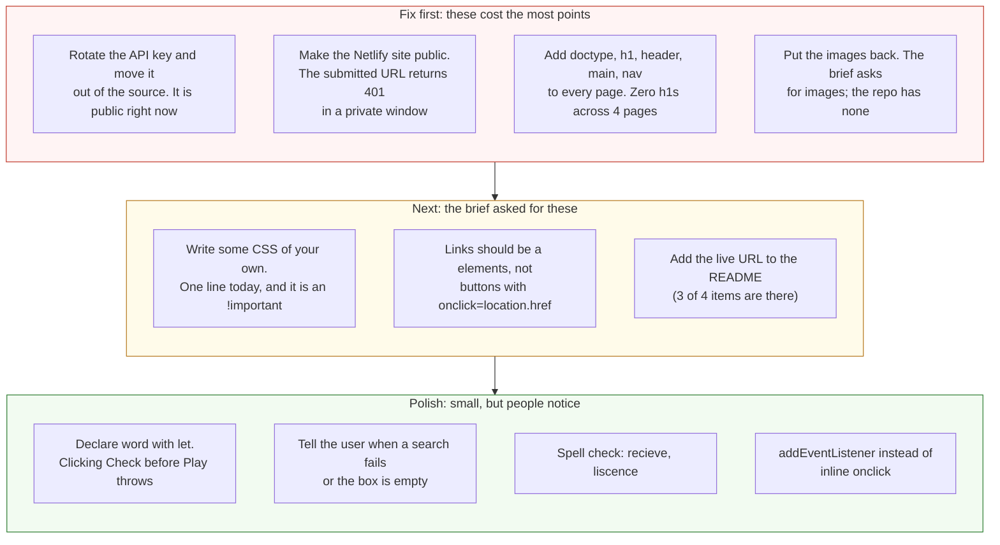

# Project 1: Static Foundations — Feedback

**Student:** Maia Diaz (scramgledeggs) · **Repo:** [scramgledeggs/scramgledeggs.github.io](https://github.com/scramgledeggs/scramgledeggs.github.io)
**Submitted live URL:** [scintillating-bavarois-7077d8.netlify.app](https://scintillating-bavarois-7077d8.netlify.app/) (private, see below) · **Public copy:** [scramgledeggs.github.io](https://scramgledeggs.github.io/)
**Reviewed at commit:** `a6d1f17` · **Course:** CSC 436, Fall 2026

> **How this review was made.** Your instructor reviewed this project with [Claude](https://claude.com) (Anthropic's AI) as a second set of eyes. Claude cloned the repo, read all four pages, loaded the site at phone, tablet and desktop widths, ran the W3C validator on every page, searched the dictionary with a real word, an empty box and a nonsense word, played the guessing game, and read the console. Every note and every point below was read and approved by your instructor. Same standard, same rubric, just more time spent looking at *your* code than one human has in a grading week.

> **About this submission.** You said up front that this is your final project from last semester, submitted because you ran out of time. Your instructor accepted that, once. So this review grades the site you submitted against this project's rubric, on its merits. The fact that the commit history predates the class wasn't held against you. Everything else in the rubric was applied the same way it was for everyone.

## Grade: 51 / 100

| Category | Points | Earned | One line |
|---|:-:|:-:|---|
| Semantic HTML | 20 | 6 | No doctype on any page, zero `h1`s across four pages, one `footer` and no other semantic element |
| CSS layout | 25 | 15 | Bootstrap does the layout and that's allowed; you wrote one line of CSS, and it's an `!important` |
| Responsive design | 15 | 11 | No horizontal scroll, sidebar hides on phones; no media query of your own |
| JavaScript interaction | 15 | 10 | Search and game both work against a live API; failures are silent, and Check-before-Play throws |
| Repository and deployment | 15 | 5 | Submitted URL is private; an API key is committed to a public repo; README has no live URL |
| Content and polish | 10 | 4 | A real idea with a real API; zero images, two typos, and no way to know when a search failed |
| **Total** | **100** | **51** | **The JavaScript instincts are real. The HTML and CSS this project was testing aren't here yet.** |

## The short version

Your note said this would show where you're at, and it does. You can call a REST API, check the response, parse JSON, and put the result on the page. You can build a small game loop. That's real, and it's more than some people in this class attempted.

But this project was called Static Foundations for a reason. It was testing semantic HTML, hand-written layout CSS, and responsive design, and those three things are mostly absent. None of the four pages has a doctype, so every one fails the validator on line 1. None has an `h1`; the titles are paragraphs with a Bootstrap class that makes them big. The only semantic element on the whole site is one `footer`. The only CSS you wrote is a single line that forces the background color with `!important`. And two things that aren't about skill: the URL you submitted is private, and there's a Merriam-Webster API key sitting in a public repository, which the brief specifically told you never to do.

The gap between this and a passing Project 1 isn't talent. It's the skeleton. The rest of this review shows exactly where it goes.

## What the numbers looked like

Things Claude measured (so you know these aren't guesses):

| Check | Result |
|---|---|
| Submitted Netlify URL in a private window | HTTP 401, "This site is private" |
| Same site on GitHub Pages | HTTP 200, loads normally |
| Horizontal scroll at 375 / 768 / 1280 px | None at any width |
| W3C validator | 1 error per page, 4 pages: missing `<!DOCTYPE html>` |
| `h1` elements across 4 pages | 0 |
| Semantic elements across 4 pages | 1 (`footer` on the home page) |
| Lines of CSS you wrote | 1: `body { background: #fff1cc !important; }` |
| Media queries of your own | 0 (the sidebar hides via Bootstrap's `d-none d-md-block`) |
| Images | 0 (the one image in the repo was deleted the day before submission) |
| Dictionary search, "buzz" | Works: "a communication by telephone" |
| Dictionary search, empty box | Console error; previous answer stays on screen |
| Dictionary search, nonsense word | Console error; previous answer stays on screen |
| Guessing game | Works: word, part of speech, definition, correct and wrong answers |
| Clicking Check before Lets play | `ReferenceError: word is not defined` |
| API key in source | Yes, on page1.html line 40 and page2.html line 66, in a public repo |
| README | Title, description, how to run. No live URL |
| Commits since the project was assigned | 2: delete an image, update README |

---

## Semantic HTML — 6 / 20

**What's working**

- `lang="en"`, a charset, a viewport tag and a `<title>` on every page. The home page has a `footer`. Form inputs on the search and game pages have ids and placeholders.

**What to change**

- **No doctype.** Every page starts with `<html lang="en">` ([index.html L1](https://github.com/scramgledeggs/scramgledeggs.github.io/blob/a6d1f17/index.html#L1)). Without `<!DOCTYPE html>` on the line above it, browsers render in quirks mode and the validator stops at line 1. One line, four times.
- **No `h1`, anywhere.** "FUN-ctionary!" is `<p class="display-3">` ([L16](https://github.com/scramgledeggs/scramgledeggs.github.io/blob/a6d1f17/index.html#L16)). "Thesaurus Search" and "Word Guess" are `<p class="display-5">`. Bootstrap's `display-*` classes are meant to go on headings; they make text look like a title without making it one. Every page needs one `h1`, and screen readers, search engines and the validator all count them.
- **One semantic element on the site.** The brief asked for at least three content sections built from `header`, `nav`, `main`, `section`, `article`, `footer`. The home page has a `footer` and nothing else; the other three pages have none. The yellow banner is a `header`. The three big buttons are a `nav`. The sidebar is an `aside`. The search form and results are `main`. Same Bootstrap classes, real elements underneath.

  ```mermaid
  flowchart TB
      subgraph now["Now: index.html, no doctype, lines 15 to 49"]
          direction TB
          a1["body"] --> a2["div.bg-warning<br/><b>p</b>.display-3 FUN-ctionary!<br/>(looks like a title, is a paragraph)"]
          a1 --> a3["div.row"]
          a3 --> a4["div.col-3 sidebar<br/>hidden on phones"]
          a3 --> a5["div.d-grid<br/>3 <b>button</b>s with<br/>onclick=location.href<br/>(look like links, are buttons)"]
          a1 --> a6["footer"]
          a7["Semantic elements: footer.<br/>h1 count: 0 on all 4 pages.<br/>Validator: missing doctype x4."]
          a1 -.- a7
      end
      subgraph next["What the brief asks for: 3+ semantic sections, one h1"]
          direction TB
          b1["body"] --> b2["<b>header</b><br/><b>h1</b> FUN-ctionary! + tagline"]
          b1 --> b3["<b>main</b>"]
          b3 --> b4["<b>aside</b> About Merriam-Webster<br/>(same classes, real element)"]
          b3 --> b5["<b>nav</b><br/>3 <b>a</b> links styled as buttons:<br/>class=btn btn-outline-info"]
          b1 --> b6["footer"]
      end
      now ==>|"same Bootstrap classes,<br/>real elements underneath"| next
      style a2 fill:#fde2e2,stroke:#c0392b,color:#111
      style a5 fill:#fde2e2,stroke:#c0392b,color:#111
      style a7 fill:#fff4d6,stroke:#b7791f,color:#111,stroke-dasharray: 5 5
      style b2 fill:#e3f4e1,stroke:#2e7d32,color:#111
      style b3 fill:#e3f4e1,stroke:#2e7d32,color:#111
      style b4 fill:#e3f4e1,stroke:#2e7d32,color:#111
      style b5 fill:#e3f4e1,stroke:#2e7d32,color:#111
  ```

- **Buttons used as links.** `<button onclick="location.href='page1.html'">` ([L34–38](https://github.com/scramgledeggs/scramgledeggs.github.io/blob/a6d1f17/index.html#L34-L38)) and the "Take me back!" buttons on every other page. Anything that goes to another page is an `<a href>`. Bootstrap's `btn` classes work on links, so `<a href="page1.html" class="btn btn-outline-info btn-lg">` looks identical, works without JavaScript, and can be opened in a new tab.
- **The search "form" isn't a form** ([page1.html L22–28](https://github.com/scramgledeggs/scramgledeggs.github.io/blob/a6d1f17/page1.html#L22-L28)). A `div.form-group` with an input and a button. Wrap it in `<form>` with a `submit` handler and pressing Enter works, which is what everyone does in a search box.
- Small: `<style type="text/css">` is a leftover from 2005. Drop the attribute.

## CSS layout — 15 / 25

**What's working**

- Bootstrap is doing real layout work, and Bootstrap is allowed. The home page is a flex `row` with a `col-3` sidebar and a `col-8` button column. `d-grid gap-2` stacks the buttons with even spacing. The palette (cream, yellow, cyan) is consistent across all four pages.

**What to change**

- **You wrote one line of CSS.** `body { background: #fff1cc !important; }` ([index.html L8](https://github.com/scramgledeggs/scramgledeggs.github.io/blob/a6d1f17/index.html#L8)), repeated in each page's `<style>` block. The `!important` is there to beat Bootstrap's own body rule, which is a sign the fight is being lost. The brief's CSS category is about layout you author: a Flexbox or Grid rule you wrote, spacing you chose. There isn't one. Even a `site.css` with the banner, the button column and the sidebar written out by hand would change this score more than anything else on the sheet.
- **`m-5` on everything.** Banner, row, search box, result box, credits box: all `m-5`. That's not a spacing system, it's one number. On a phone `m-5` is 3rem on each side, which is why the content column is so narrow at 375px.
- **`md-6` isn't a class** ([L23](https://github.com/scramgledeggs/scramgledeggs.github.io/blob/a6d1f17/index.html#L23)). Bootstrap has `col-md-6`; `md-6` matches nothing and does nothing. Claude checked: no stylesheet defines it.
- **The same `<style>` block is pasted into four pages.** Move it to one `style.css` and link it. When you add a second rule, you'll thank yourself.

## Responsive design — 11 / 15

**What's working**

- No horizontal scroll at any width. The sidebar disappears below 768px via `d-none d-md-block`, and the button column takes the full width. Text wraps. Nothing breaks.

**What to change**

- **No media query of your own.** The one responsive decision on the site is Bootstrap's `d-md-block`. The brief asked for the layout to adapt meaningfully using media queries or intrinsic patterns you wrote. Hiding a column is the bluntest version of adapting: on a phone, the contact email and GitHub link are simply gone.
- **The phone layout is cramped by `m-5`.** At 375px, 3rem margins on both sides leave about 280px for content, and the "Credits and API information" button wraps to three lines. A `m-3` on small screens (`m-3 m-md-5`) fixes it with the tools you're already using.

## JavaScript interaction — 10 / 15

**What's working**

- **Two real features against a live API.** The search ([page1.html L35–55](https://github.com/scramgledeggs/scramgledeggs.github.io/blob/a6d1f17/page1.html#L35-L55)) is `async`/`await`, checks `response.ok`, parses JSON, and writes the definition to the page. The game ([page2.html L41–81](https://github.com/scramgledeggs/scramgledeggs.github.io/blob/a6d1f17/page2.html#L41-L81)) picks a random word, fetches its part of speech and definition, and checks the guess case-insensitively. Both work; Claude searched "buzz" and got a definition, played the game and got "Correct!!!" and "wuh oh :( nope." Good instincts: `try`/`catch`, `toLowerCase()` on input, an early `return` on the correct branch.

**What to change**

- **`word` is never declared.** `word = wordSelection[random]` ([page2.html L46](https://github.com/scramgledeggs/scramgledeggs.github.io/blob/a6d1f17/page2.html#L46)) creates an accidental global. Click "Check!" before "Lets play!" and the page throws `ReferenceError: word is not defined`. `let word;` at the top of the script fixes it. Same for `var random`: use `const`.
- **Failures are silent, and stale.** Search with an empty box and the API answers "Word is required." as plain text, `response.json()` throws, the `catch` logs to the console, and the previous definition stays on screen as if it were the answer. Search a nonsense word and the API returns a list of suggestions instead of entries, `data[0].shortdef` is undefined, and the same thing happens. Two console errors from ordinary use, and the user never learns anything went wrong. In the `catch`, write to the result element: "No definition found for that word." And check for an empty box before fetching.
- **Inline `onclick` and `innerHTML`.** Every handler is `onclick="..."` in the HTML. The pattern this class teaches is `addEventListener` in the script, which keeps behavior out of the markup. And `innerHTML = definition` inserts whatever the API sent as HTML; `textContent` is what you mean for plain text.
- The search box doesn't submit on Enter. See the `<form>` note above; a `submit` listener with `event.preventDefault()` gives you Enter for free.

## Repository and deployment — 5 / 15

**What's working**

- The README has a title, a real description, and how to run it. The site is deployed and the GitHub Pages copy works in a private window.

**What to change**

- **The submitted URL is private.** `scintillating-bavarois-7077d8.netlify.app` returns 401 with "This site is private. Sign in with an invited Netlify account to view it." The brief: "Both links must work in a private or incognito browser window. If a link is broken at grading time, the project is graded on what I can see, which may be nothing." Your GitHub Pages copy is public and identical, which is why there's a grade. Turn off site protection in Netlify (Site configuration → Access & security), and test in a private window before you submit anything again.
- **An API key is committed to a public repository.** `key=79f6cc56-...` is in [page1.html L40](https://github.com/scramgledeggs/scramgledeggs.github.io/blob/a6d1f17/page1.html#L40) and [page2.html L66](https://github.com/scramgledeggs/scramgledeggs.github.io/blob/a6d1f17/page2.html#L66). The brief says, in its own words: "Never commit secrets. If a key lands in your history, rotate it and tell me." It's a free-tier dictionary key, so the blast radius is small, but the habit is the whole point. Anyone can copy it and use up your 1,000 daily queries, and it's in every commit since December, so deleting it now doesn't remove it from history.

  ```mermaid
  flowchart TB
      k["page1.html line 40 and page2.html line 66<br/>fetch(...thesaurus/json/word?key=79f6cc56-...)<br/>a Merriam-Webster API key, in the source"]
      g["Pushed to a <b>public</b> GitHub repo<br/>and served on a public site.<br/>Anyone can read it, copy it, and spend<br/>your 1,000 queries a day."]
      b["The brief: Never commit secrets.<br/>If a key lands in your history,<br/><b>rotate it and tell me</b>."]
      r1["1. Rotate: generate a new key<br/>at dictionaryapi.com and revoke this one"]
      r2["2. Keep it out of the page: for a static<br/>site that means a Netlify Function<br/>or a proxy that holds the key"]
      r3["3. Tell your instructor it happened.<br/>That is the rule, and it is the habit<br/>every employer will expect"]
      k --> g --> b
      b --> r1 & r2 & r3
      style k fill:#fde2e2,stroke:#c0392b,color:#111
      style g fill:#fde2e2,stroke:#c0392b,color:#111
      style b fill:#fff4d6,stroke:#b7791f,color:#111
      style r1 fill:#e3f4e1,stroke:#2e7d32,color:#111
      style r2 fill:#e3f4e1,stroke:#2e7d32,color:#111
      style r3 fill:#e3f4e1,stroke:#2e7d32,color:#111
  ```

- **README is missing the live URL,** the fourth required item.
- **Commit messages are GitHub's defaults.** "Add files via upload," "Update index.html," "Delete ganymedeling.jpg." The timeline wasn't held against you, but the messages still tell a reader nothing. The brief asked for "add nav," "fix card layout."

## Content and polish — 4 / 10

**What's working**

- A real idea, built on a real API, with a game that's actually a little fun. The voice in the copy ("Only seven words are currently in rotation, since I probably wouldn't be able to guess it otherwise!") is yours.

**What to change**

- **Zero images.** The brief asked for real text and images that fit the theme. The repo had one image, `ganymedeling.jpg`, and it was deleted the day before you submitted. A site about words could show a dictionary, a thesaurus page, the Merriam-Webster logo with credit. Right now it's colored boxes.
- **The user can't tell when something failed.** See JavaScript. From the user's side, a bad search looks like the old answer.
- **Spelling:** "recieve" ([page1.html L17](https://github.com/scramgledeggs/scramgledeggs.github.io/blob/a6d1f17/page1.html#L17)), "liscence" ([page3.html L26](https://github.com/scramgledeggs/scramgledeggs.github.io/blob/a6d1f17/page3.html#L26)). On a dictionary site, especially.
- "Endpoints accessed: fl and shortdef" on the credits page: those are fields in the response, not endpoints. The endpoint is `/references/thesaurus/json/{word}`.

---

## Your next three moves



1. **Rotate the key today, and make the Netlify site public.** Both are ten-minute tasks, and both are things the brief said in plain words. Then tell your instructor the key was rotated.
2. **Give every page a skeleton.** Doctype, `header` with an `h1`, `nav` of real links, `main`, `footer`. Same Bootstrap classes on top. An hour for four pages, and it's most of the 14 points you lost in the first category.
3. **Before Project 2, write one page with no Bootstrap at all.** Header in Flexbox, cards in Grid, one media query, all in a CSS file you wrote. Not because Bootstrap is bad, but because this class is going to ask you to know what it's doing for you.

You were honest about what this is, and you asked to be graded on where you're at. Here's where you're at: you can make a page talk to an API. The next skill is making the page itself right, and it's a smaller step than the one you've already taken.

*This PR only adds feedback files. It does not touch your code. Merge it, close it, or just read it, your call. Questions go to office hours or the Brightspace board.*
